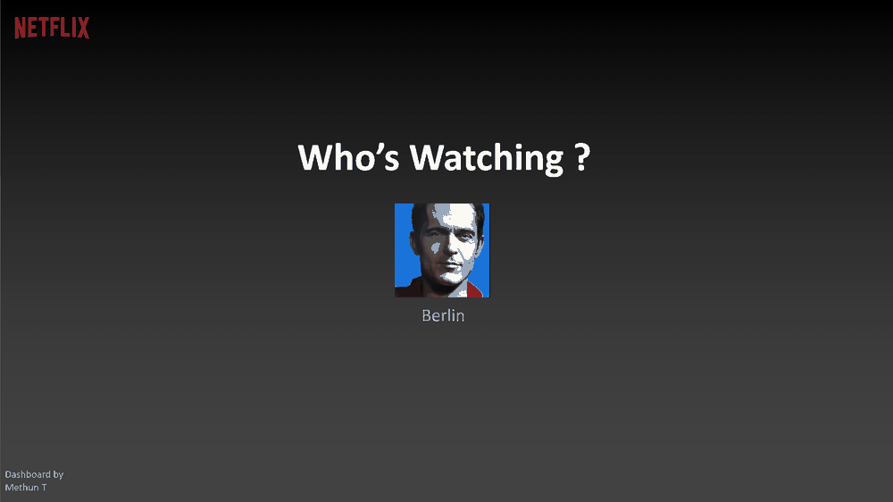

<a href="screenshots/Berlin.png">
  <h1>What's On Netflix</h1>
  <picture>
    <source media="(prefers-color-scheme: dark)" srcset="assets/hero-dark.svg">
    
  </picture>
</a>

<p>
  
  
  
  
  
</p>

One Kaggle CSV of everything Netflix listed up to September 2021, turned into a semantic model that answers **what the catalogue is made of, where it comes from, and when it arrived** — and kept as diffable PBIP text rather than a binary.

| | | |
|---|---|---|
| 📼 | **[The dataset](#-dataset)** | 8,807 rows, 12 columns, and three of them hold lists rather than values. |
| ✂️ | **[Making it answerable](#-shape)** | What had to change before "titles by genre" meant anything. **This is most of the work.** |
| 🔎 | **[What the catalogue looks like](#-findings)** | The findings, with the numbers that produced them. |
| ⚙️ | **[How it is built](#-build)** | One shared query, two grains, and a bridge table that lost 7.8× its rows. |
| ▶️ | **[Run it yourself](#-run)** | Clone, repoint one path, refresh. **You must edit the CSV path.** |

---

## 🎯 What it is for

| 1 · A cell that holds a list | 2 · Counting the same title twice | 3 · "How big is Netflix?" |
|---|---|---|
| A title's genre, country and cast arrive as comma-separated text — `Dramas, International Movies` in a single cell. Nothing can group by that. | Split those lists and every title now occupies several rows, so a naive count of a 2-genre, 3-country film reports six. | Three defensible answers exist, and they disagree. Rows are 8,804; distinct titles are 8,799; movies plus shows is 8,801. |
| **6,787 of 8,804 titles** list more than one genre and **1,320** more than one country. Both are split into their own rows. | Every measure counts `DISTINCTCOUNT` of title, never rows, so duplication from the split cannot inflate a number. | All three are correct, and [the reference section](#-gotchas) explains exactly which titles cause each gap. |

<a href="https://app.powerbi.com/view?r=eyJrIjoiYTNhODg5M2MtYWIyOS00M2FlLWEyYzUtNDRkZTUzYmExMGZjIiwidCI6IjExMWJhNTQ2LWQ1ZjQtNDgwYS05OGE3LWRmYjYzYjgzMGZiMSIsImMiOjEwfQ%3D%3D"></a>

---

<a id="-wired"></a>

## 🔌 How it is wired

<picture>
  <source media="(prefers-color-scheme: dark)" srcset="assets/schema-dark.svg">
  
</picture>

One CSV is cleansed **once**, in a shared query called `NetflixSource`, and two tables read from it. `Netflix` splits the list columns apart so you can slice by genre and country. `Dim Title` leaves them alone, so anything counted per title stays at one row per title. A `Date` calendar comes from its own query — nothing to do with the CSV — and joins the bridge on the date a title was added, which is what every "in each year" chart is built on.

---

<a id="-dataset"></a>

## Part 1 — The dataset


The source is the **[Netflix Movies and TV Shows](https://www.kaggle.com/datasets/shivamb/netflix-shows)** dataset on Kaggle — a snapshot of the catalogue, not a viewing or revenue log. There is no watch time in it and no subscriber data, so nothing here says what was *popular*; it describes what was *available*.

| | Column | What it carries |
|---|---|---|
| 🆔 | `show_id` | `s1`, `s2`, … — a text key with a letter glued to the front |
| 🎬 | `type` | Movie or TV Show, the split behind almost every visual |
| 📝 | `title`, `description` | free text |
| 🎥 | `director`, `cast` | credits; `cast` is a comma-separated list of up to dozens of people |
| 🌍 | `country` | production country, **often several per title** |
| 📅 | `date_added` | when it landed on Netflix — the only date the report trends on |
| 🗓️ | `release_year` | when it was made, which is not when it arrived |
| 🔞 | `rating` | TV-MA, PG-13, … |
| ⏱️ | `duration` | `90 min` for films, `2 Seasons` for shows — two units in one column |
| 🏷️ | `listed_in` | genre, **and also usually a list** |

**What is missing matters as much as what is there.** These are the gaps, counted after cleaning:

| | Gap | Rows | Consequence |
|---|---|---|---|
| 🎥 | no director | **2,634** | Nearly a third of the catalogue. The director chart necessarily excludes them. |
| 🌍 | no country | **831** | These form their own blank bar in any country visual rather than disappearing. |
| 👥 | no cast | **825** | — |
| 📅 | no `date_added` | **10** | All TV shows. They cannot join the calendar, so they sit outside every yearly trend. |

---

<a id="-shape"></a>

## Part 2 — Making it answerable


Each change to the raw file exists to answer a business question the spreadsheet could not. Left column: what changed. Right column: **what the dashboard can now tell you because of it.**

| | What changed | What it lets the business see |
|---|---|---|
| ✂️ | The genre list became **one row per genre** — a title filed under `Dramas, International Movies` now sits under both | *Which genres is Netflix actually buying?* Answerable for the first time — see [Part 3](#-findings) for which genre actually leads. |
| 🌍 | The country list was split the same way, so a co-production belongs to each of its countries | *Where is the catalogue sourced from?* **122 countries**, with concentration at the top and a very long tail — see [Part 3](#-findings) for the breakdown. |
| 📅 | `date_added` became a real date joined to a calendar | *When did the library get big, and is it still growing?* The growth story has an ending — see [Part 3](#-findings) for the year-by-year numbers. |
| 🏷️ | Columns were renamed to business names — `listed_in` became `Genre`, `date_added` became `Date Added` | Anyone can build their own view without a data dictionary; the field list *is* the interface |
| 🔞 | Ratings were cleaned so the slicer holds only real ratings | *Who is the catalogue made for?* Answerable directly from the slicer — see [Part 3](#-findings) for the split. |
| 👥 | A second, unsplit copy of the table was kept alongside the split one | Title counts stay honest. A 2-genre, 3-country film is one title, not six — so "how many titles" and "titles by genre" can both be right at once |

> [!IMPORTANT]
> Splitting a list column is a deliberate trade: it makes grouping possible and makes row counts meaningless. Every measure counts `DISTINCTCOUNT` of title rather than rows, which is what lets the catalogue be sliced by genre and country without ever double-counting a title.

---

<a id="-findings"></a>

## Part 3 — What the catalogue actually looks like


<picture>
  
</picture>

The report opens on a Netflix-style **"Who's Watching?"** profile picker. Choosing a profile opens the dashboard, whose left rail switches between **Summary**, **Movies** and **TV Shows** — the same questions asked three times, once across everything and once for each half of the catalogue.

| | The question | What the data says |
|---|---|---|
| 🎬 | **Is Netflix a film service or a TV service?** | Films, roughly 7 to 3 — **6,126 movies** against **2,675 TV shows**. But shows carry slightly more genre variety: 22 distinct genres against 21. |
| 📈 | **When did the catalogue actually grow?** | Almost entirely after 2015. Additions go **56 → 251 → 837 → 1,237 → 1,424** films a year from 2015 to 2019, then fall. 2016 is the inflection, not the launch year. |
| 📉 | **Is it still growing?** | No. Films peaked in **2019 at 1,424 added**, and fell in both following years. 2021 is a partial year — the snapshot stops on **25 September 2021**. |
| 🔀 | **Did film and TV turn at the same time?** | No, and this is the sharpest finding on the page. **Films peaked in 2019, series in 2020** at 595. TV kept growing for a full year after film had already turned down — visible by flipping the left rail between the Movies and TV Shows views. |
| 🌍 | **How American is it?** | Less than reputation suggests, but still dominant: **3,685 US titles** against **1,046 from India** and **806 from the UK**. India is second by a wide margin. |
| 🔞 | **Who is it made for?** | Adults. **TV-MA is the single largest rating at 3,205 titles**, with TV-14 next at 2,160. Children's ratings are a small tail. |
| 🏷️ | **What is it mostly made of?** | **International Movies leads at 2,750 titles**, then Dramas at 2,426 and Comedies at 1,672. The top genre is a *provenance* label, not a genre — which is itself the finding. |
| 🎥 | **Is there an auteur catalogue?** | No. The most prolific director, **Rajiv Chilaka, has 19 titles** — children's animation, not prestige film. Netflix's library is broad, not deep in any one name. |

---

<a id="-build"></a>

## Part 4 — How it is built


The model works, and it was also doing a lot of unnecessary work. Three changes, none of which move a number on any visual:

| | Change | Effect |
|---|---|---|
| 🔁 | Both tables parsed the same CSV independently, with near-identical 15-step scripts. Extracted into one shared query, `NetflixSource`. | The file is read and cleansed once. The CSV path now appears in one place instead of two. |
| ✂️ | The bridge table also split the **cast** list, multiplying rows by every credited actor — and `Cast` is never read from that table. | **≈186,000 rows → 23,760**, a 7.8× reduction. |
| 🧮 | A `Table.TransformColumnTypes(…, "en-GB")` ran against a column the previous step had already typed as a date. | A whole-table pass removed for no change in output. |

Alongside that, 7 of the 14 measures had no-op wrappers removed — a bare `CALCULATE()` with no filter, and `KEEPFILTERS` sitting inside `AVERAGEX` where it is not a filter argument and does nothing. Every value on every visual is identical before and after.

---

<a id="-run"></a>

## ▶️ Run it yourself

The live link above needs nothing at all. To open the project itself you need **Power BI Desktop**; no cloud account is involved.

```bash
git clone <this repo>
# the folder name contains a space, so quote the path
cd "PowerBi/Netflix Dashboard"
```

Open `powerbi/Netflix.pbip`, then point the source at your own clone: **Power Query → `NetflixSource` → `File.Contents`** takes an absolute path to `data/netflix_titles.csv`. Set it once and refresh.

---

## 📚 Reference

Everything below is reference — read it when you need it.

<a id="-gotchas"></a>

### Gotchas

| Term | What will bite you |
|---|---|
| **Three different "total titles"** | The table holds **8,804 rows**; `DISTINCTCOUNT` of title returns **8,799**; the two KPI cards sum to **8,801**. All three are right — see the two rows below. |
| **DAX text comparison ignores case** | Five title pairs differ only in capitalisation — `Death Note` / `DEATH NOTE`, `FullMetal Alchemist` / `Fullmetal Alchemist`, `Love in a Puff`, `Esperando la carroza`, `Sin senos sí hay paraíso` — and collapse into one another. That is 8,804 − 5 = **8,799**. A sixth pair, `Consequences`, does *not* collapse: its duplicate carries a trailing non-breaking space, which DAX does not strip. |
| **Two titles are both a film and a series** | `Death Note` and `Fullmetal Alchemist` each exist as a Movie *and* a TV Show, so they are counted once in each card. That is why 6,126 + 2,675 = 8,801 rather than 8,799. |
| **An empty string is not blank** | `DISTINCTCOUNT` reports **123** countries, **43** genres and **15** ratings, against **122**, **42** and **14** actually named — because 831 titles carry an empty country string, and DAX treats `""` as a real value. Filtering with `<> BLANK()` will not remove them. |
| **`date_added` is not `release_year`** | Every trend on the page is *when Netflix added it*, spanning 2008-01-01 to 2021-09-25. Release years run 1925–2021. A 1995 film added in 2019 appears in 2019. |
| **2021 is a partial year** | The snapshot stops on 25 September 2021. Any year-over-year read that treats 2021 as complete will show a fall that is partly just a short year. |
| **The `Netflix` table row count means nothing** | It is a bridge at title × genre × country. Counting its rows counts combinations, not titles. Use the measures. |
| **Absolute CSV path** | `NetflixSource` hardcodes `D:\Git\PowerBi\…`. Every clone must repoint it before the first refresh. |
| **The dataset is a snapshot, not a feed** | It ends in September 2021 and does not update. Nothing here describes Netflix today. |

### Data provenance

The CSV in `data/` is the public **[Netflix Movies and TV Shows](https://www.kaggle.com/datasets/shivamb/netflix-shows)** dataset from Kaggle, committed unmodified. No production or proprietary data is involved. All cleaning happens in Power Query, so the source file stays a faithful copy of what was downloaded and `scripts/build_summary.py` can recount it independently of the model.

### Licence

[MIT](LICENSE) for the code in this repo. The Kaggle CSV keeps its own licence from its source page.

### Repo layout

```
Netflix Dashboard/
├─ data/            the Kaggle CSV, unmodified
├─ powerbi/         PBIP project — Netflix.SemanticModel (TMDL) + Netflix.Report (PBIR)
├─ scripts/         summary + asset generators, screenshot crop, tour builder
├─ screenshots/     cropped page captures (_raw/ holds the 3× originals)
├─ assets/          hero/CTA/schema SVGs (light+dark), section captions (light-only) and the tour GIF
└─ summary.json     every figure this README quotes, regenerated from the CSV
```

### Full-resolution stills

<details>
<summary>Page captures at full size</summary>

| View | Still |
|---|---|
| Who's Watching — profile picker | [Home.png](screenshots/Home.png) |
| Summary | [Berlin.png](screenshots/Berlin.png) |
| Movies | [Movies.png](screenshots/Movies.png) |
| TV Shows | [TVShows.png](screenshots/TVShows.png) |

Captured at 3× and cropped to the report canvas by `scripts/crop_screenshots.py`, which checks the crop against the 1800×1012 page size declared in the PBIR and fails on a mismatch.

</details>
